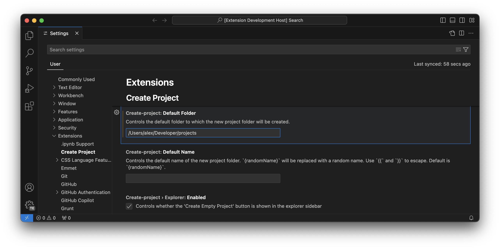

# `vscode-create-project`

1. Set the default root folder.

2. Create and open a new folder with a single command.

## License

Licensed under either of

- MIT License
   ([LICENSE-MIT](LICENSE-MIT) or http://opensource.org/licenses/MIT)
- Apache License, Version 2.0
   ([LICENSE-APACHE](LICENSE-APACHE) or http://www.apache.org/licenses/LICENSE-2.0)

at your option.

## Contribution

Unless you explicitly state otherwise, any contribution intentionally submitted
for inclusion in the work by you, as defined in the Apache-2.0 license, shall be
dual licensed as above, without any additional terms or conditions.
