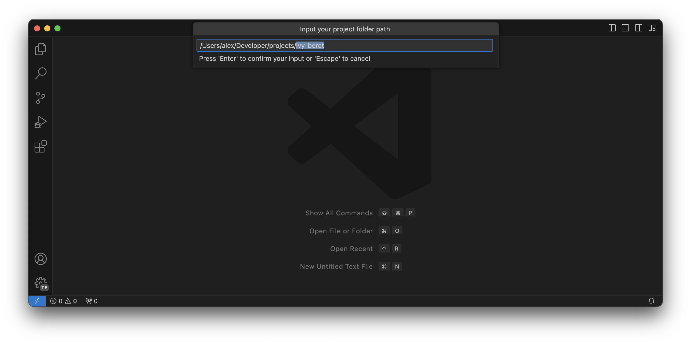

# `vscode-create-project`

1. Set the default root folder.

2. Create and open a new folder with a single command ("Create New Empty Project").

3. Or create a new project from the explorer.

## Commands

| ID | Title | Description |
| -- | ----- | ----------- |
| `create-project.create` | Create New Empty Project | Create a new empty project in the default root folder. |

## Settings

| ID | Description | Default |
| -- | ----------- | ------- |
| `create-project.defaultFolder` | The default root folder for new projects. | `""` |
| `create-project.defaultName` | The default name for new projects. | `"{randomName}"` |
| `create-project.explorer.enabled` | Whether to show "Create Empty Project" button in the explorer. | `true` |

### Default Name Format

You can use the following placeholders in the `create-project.defaultName` setting:

- `{randomName}`: A random double-word name, e.g. `happy-zebra`.

Placeholders must be enclosed in curly braces `{key}`. If a key is unknown, it is replaced with an empty string. You can escape the curly braces by doubling them `{{` and `}}`.

## License

Licensed under either of

- MIT License
   ([LICENSE-MIT](LICENSE-MIT) or http://opensource.org/licenses/MIT)
- Apache License, Version 2.0
   ([LICENSE-APACHE](LICENSE-APACHE) or http://www.apache.org/licenses/LICENSE-2.0)

at your option.

## Contribution

Unless you explicitly state otherwise, any contribution intentionally submitted
for inclusion in the work by you, as defined in the Apache-2.0 license, shall be
dual licensed as above, without any additional terms or conditions.
